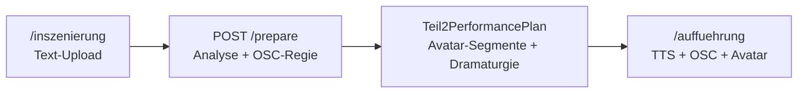

# Teil 2: Text-Sync mit KI-Regie und Avatar-Anker

Separater Modus für **Elfriede Jelinek — *Unter Tieren***: hochgeladener Aufführungstext, ein KI-Vorbereitungsschritt, eine wählbare TTS-Stimme als Master-Clock, Avatar-Videos feuern wenn die Stimme die CSV-Textstelle (Zeichenoffset) erreicht.

**Teil 1** (`/dramaturgie`, `/auffuehrung`): unverändert — ein Stücktext, sequentielle Aufführung.

**Teil 2**: `/inszenierung` → Text hochladen → **Vorbereiten** → `/inszenierung/auffuehrung`

---

## Überblick



| Schritt | Route / API | Ergebnis |
|---------|-------------|----------|
| 1. Korpus | `/inszenierung` | `SceneCorpus` mit `script_text` |
| 2. Vorbereiten | `POST /api/v1/inszenierung/{id}/prepare` | `teil2_plan` + `gesamtkonzept` |
| 3. Aufführung | `/inszenierung/auffuehrung` | Satzweise TTS, OSC parallel, Avatar bei CSV-Anker |

Persistenz: `data/inszenierungen/{id}.json`

Legacy-Routen `/inszenierung/analyse` und `/inszenierung/komposition` leiten auf `/inszenierung` um. Beat-basierte `composition` bleibt für alte Exporte lesbar.

---

## Datenmodell

- `SceneCorpus.script_text` — vollständiger Aufführungstext (Upload oder Kanon-Vorlage)
- `SceneCorpus.teil2_plan` — `Teil2PerformancePlan`:
  - `sentences` — Satzliste (Backend `split_sentences`, identisch zum Frontend)
  - `sentence_char_starts` — Zeichenoffset je Satz im `script_text`
  - `avatar_segments` — CSV-Text → `char_offset`, `start_sentence_index` / `end_sentence_index`
  - `dramaturgy` — OSC-Regie mit `sentence_index`, `keyword`, `time_offset_sec`
  - `performance_speaker` — `AI_A` | `AI_B` | `narrator`
  - `alignment_warnings` — fehlende CSV-Zeilen im Skript

---

## Skriptquellen

| Datei | Rolle |
|-------|-------|
| `Stücktext/AVATAR Text Delfin bis Wolf.txt` | Kanon-Vorlage (optional) |
| `media/video/Avatar Textzuordnung.csv` | Avatar → Text → Clip, Aufführungsreihenfolge (Spalte «Zeit» = **Sekunden**, z. B. `0:07:00` → 7 s) |
| `media/video/OSCBefehllisteAvatare.txt` | Pixera OSC — Avatar-Clips |
| `media/video/OSCBefehllisteOhneAvatare.txt` | Pixera OSC — Atmosphären (inkl. LED) |

API: `GET /api/v1/inszenierung/script` — Kanon + Beat-Vorschau  
API: `PATCH /api/v1/inszenierung/{id}` — `script_text` speichern  
API: `POST /api/v1/inszenierung/{id}/prepare` — Plan erzeugen

---

## Avatar-Anker (CSV → Zeichenoffset)

Service: `backend/app/services/teil2_text_alignment.py`

1. CSV aus `avatar_speech_catalog` laden
2. Performance-Text und CSV-`text` normalisieren
3. Substring-Suche → `char_offset` im Skript → `start_sentence_index` via `text_split.split_sentences`
4. Chorus: aufeinanderfolgende gleiche Texte → ein Segment, mehrere `avatar_layers`
5. Nicht gefundene Zeilen → `alignment_warnings`

Beispiel: Stimme erreicht «24 Der Bärenklauer…» im Text → `char_offset` → OSC `play_clip` für `BK1_Caro` (ggf. Chorus mit Caroline/Thomas).

Alte Pläne ohne `char_offset` fallen auf Satzanfang zurück — nach Änderungen einmal **neu vorbereiten**. Gleiches gilt nach Korrektur der Clip-Dauern (Beamer-Sperre nutzt `duration_ms` aus dem Plan).

### Probebetrieb (ohne Licht-TCP)

Auf `/inszenierung/auffuehrung` und `/auffuehrung`: Checkbox **Probebetrieb (OSC-Log, kein Licht)**.

- Licht-Cues werden aus Dramaturgie-Entscheidungen entfernt (kein EOS-TCP, kein Blockieren von Video)
- OSC wird als DRY-RUN geloggt (`logs/osc.log`) — Pixera-/Sound-Befehle erscheinen dort ohne Licht-Desk
- Beamer-Sperren werden bei neuem Avatar unterbrochen (`allow_avatar_interrupt`)

---

## Playback (Frontend)

`frontend/features/inszenierung/teil2TextSyncPlayback.ts`:

1. `armDirectorForPerformance()`
2. TTS-Puffer für alle Sätze (`inszenierungBuffer` — Full-Text, eine Stimme)
3. Pro Satz: `playBlob` mit `onTimeUpdate` — globale Textposition = `sentence_char_starts[i]` + proportionale Stimmenposition
4. Avatar-OSC (`fireAvatarSegmentsAtPosition`) wenn `globalPos >= segment.char_offset` — nicht mehr am Satzanfang vor der Stimme
5. Dramaturgie-OSC parallel (`fireSentenceCues` / `fireTimeCues`, `executeCueSafely`)

---

## Tests

```bash
cd backend && ruff check app tests && .venv/bin/python -m pytest tests/test_teil2_text_alignment.py tests/test_teil2_prepare_service.py -q
cd frontend && npm test -- teil2TextSyncPlayback.test.ts --run && npm run build
```

---

## Manuelle Verifikation

1. `/inszenierung` → Text hochladen (mit Bärenklauer-Passage wie in CSV)
2. **Vorbereiten** → Warnungen prüfen, Plan mit Segmenten sichtbar
3. Stimme wählen, TTS-Puffer abwarten
4. **Play** → Stimme liest durch; Avatar-Video startet wenn die Stimme den CSV-Anker erreicht (nicht schon am Satzanfang davor)
5. Anarchie steigt über den Text
