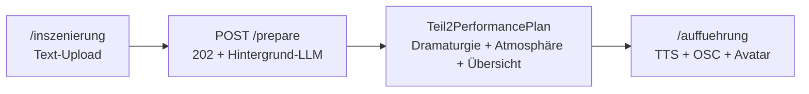

# Teil 2: Text-Sync mit KI-Regie und Avatar-Anker

Separater Modus für **Elfriede Jelinek — *Unter Tieren***: hochgeladener Aufführungstext, ein KI-Vorbereitungsschritt, eine wählbare TTS-Stimme als Master-Clock, Avatar-Videos feuern wenn die Stimme die CSV-Textstelle (Zeichenoffset) erreicht.

**Teil 1** (`/dramaturgie`, `/auffuehrung`): unverändert — ein Stücktext, sequentielle Aufführung.

**Teil 2**: `/inszenierung` → Text hochladen → **Vorbereiten** → `/inszenierung/auffuehrung`

---

## Überblick



| Schritt | Route / API | Ergebnis |
|---------|-------------|----------|
| 1. Korpus | `/inszenierung` | `SceneCorpus` mit `script_text` |
| 2. Vorbereiten | `POST /api/v1/inszenierung/{id}/prepare` (202) | Hintergrund-Job: `status: preparing` → `ready` |
| 3. Übersicht | `/inszenierung` nach Prepare | Stücktext mit eingezeichneten Cues |
| 4. Aufführung | `/inszenierung/auffuehrung` | Satzweise TTS, OSC parallel, Avatar bei CSV-Anker |

Persistenz: `data/inszenierungen/{id}.json`

Legacy-Routen `/inszenierung/analyse` und `/inszenierung/komposition` leiten auf `/inszenierung` um. Beat-basierte `composition` bleibt für alte Exporte lesbar.

---

## Datenmodell

- `SceneCorpus.script_text` — vollständiger Aufführungstext (Upload oder Kanon-Vorlage)
- `SceneCorpus.teil2_plan` — `Teil2PerformancePlan`:
  - `sentences` — Satzliste (Backend `split_sentences`, identisch zum Frontend)
  - `sentence_char_starts` — Zeichenoffset je Satz im `script_text`
  - `avatar_segments` — CSV-Text → `char_offset`, `start_sentence_index` / `end_sentence_index`
  - `dramaturgy` — Licht/Sound an dramaturgischen Stichworten (`trigger: keyword`)
  - `atmosphere_cue_points` — zeitbasierte B-Roll-Clips (`OSCBefehllisteOhneAvatare`) auf freien Beamern
  - `cue_overview` — vorberechnete Stücktext-Übersicht mit Cue-Badges
  - `performance_speaker` — `AI_A` | `AI_B` | `narrator`
  - `alignment_warnings` — fehlende CSV-Zeilen im Skript
- `SceneCorpus.prepare_phase` / `prepare_error` — Fortschritt/Fehler beim Hintergrund-Prepare

### Zwei Cue-Spuren

1. **Textgebunden** (`dramaturgy.cue_points`): Chunkweise LLM-Zuweisung — das LLM **findet selbst** dramaturgisch auffällige Stichworte im Text (keine vorgegebene Wortliste), mehrere Cues pro Abschnitt, stimmungsunabhängig, Anarchie steigt mit Textposition.
2. **Atmosphäre parallel** (`atmosphere_cue_points`): zeitbasierte B-Roll-Clips auf freien Beamern.

Teil 2 nutzt **keine** Multi-LLM-Diskussion wie Teil 1. Chunkweise Stichwort-Entdeckung + Cue-Zuweisung durch das LLM; Regel-Fallback (`extract_text_fallback_keywords`) nur ohne API.

---

## Skriptquellen

| Datei | Rolle |
|-------|-------|
| `Stücktext/AVATAR Text Delfin bis Wolf.txt` | Kanon-Vorlage (optional) |
| `media/video/Avatar Textzuordnung.csv` | Avatar → Text → Clip, Aufführungsreihenfolge (Spalte «Zeit» = **Sekunden**, z. B. `0:07:00` → 7 s) |
| `media/video/OSCBefehllisteAvatare.txt` | Pixera OSC — Avatar-Clips |
| `media/video/OSCBefehllisteOhneAvatare.txt` | Pixera OSC — Atmosphären (inkl. LED) |

API: `GET /api/v1/inszenierung/script` — Kanon + Beat-Vorschau  
API: `PATCH /api/v1/inszenierung/{id}` — `script_text` speichern  
API: `POST /api/v1/inszenierung/{id}/prepare` — Plan erzeugen

---

## Avatar-Anker (CSV → Zeichenoffset)

Service: `backend/app/services/teil2_text_alignment.py`  
Quelle: `media/video/Avatar Textzuordnung.csv` (export aus `Textzuordnung Del-Wolf-…numbers` via `make avatar-import`)

1. CSV-Zeilen in **Aufführungsreihenfolge** (`csv_sequence_index`)
2. Performance-Text und CSV-`text` normalisieren → `char_offset` im Skript
3. Chorus: aufeinanderfolgende gleiche Texte → ein Segment, mehrere `avatar_layers` (gleicher Moment, verschiedene Projektoren/Clips — OSC aus `OSCBefehllisteAvatare.txt`)
4. Atmosphäre parallel auf **freien** Beamern (`OSCBefehllisteOhneAvatare.txt`)
5. Nicht gefundene Zeilen → `alignment_warnings`

**Playback:** Avatar-OSC nur **eins nach dem anderen** in CSV-Reihenfolge, wenn die TTS-Stimme den Textanker (`char_offset`) erreicht — kein Nachladen aller offenen Clips am Ende.

Beispiel: Stimme erreicht «24 Der Bärenklauer…» → OSC `KI_Adam.BK1_Caro` (Chorus ggf. parallel auf Eva/RZ21).

Alte Pläne ohne `char_offset` / `csv_sequence_index` — einmal **neu vorbereiten**.

### Probebetrieb (ohne Licht-TCP)

Auf `/inszenierung/auffuehrung` und `/auffuehrung`: Checkbox **Probebetrieb (OSC-Log, kein Licht)**.

- Licht-Cues werden aus Dramaturgie-Entscheidungen entfernt (kein EOS-TCP, kein Blockieren von Video)
- Checkbox synchronisiert sofort `performance_tryout` am Director (auch während der Aufführung umschaltbar)
- OSC wird als DRY-RUN geloggt (`logs/osc.log`) — Pixera-/Sound als `[OSC DRY-RUN …]`, keine `[LIGHT FAILED]`
- Beamer-Sperren werden bei neuem Avatar unterbrochen (`allow_avatar_interrupt`)

---

## Playback (Frontend)

`frontend/features/inszenierung/teil2TextSyncPlayback.ts`:

1. `armDirectorForPerformance()`
2. TTS-Puffer für alle Sätze (`inszenierungBuffer` — Full-Text, eine Stimme)
3. Pro Satz: `playBlob` mit `onTimeUpdate` — globale Textposition = `sentence_char_starts[i]` + proportionale Stimmenposition
4. Avatar-OSC (`scheduleAvatarSegmentsAtPosition`) — **nächstes** Segment in CSV-Reihenfolge, wenn `globalPos >= char_offset` (Chorus: alle Layer eines Segments gleichzeitig)
5. Dramaturgie-OSC parallel (`fireSentenceCues` / `fireTimeCues` für `atmosphere_cue_points`, `executeCueSafely`)

---

## Performance (Prepare)

Typische Dauer-Treiber und Einstellungen:

| Phase | Vorher | Jetzt |
|-------|--------|-------|
| Analyse + Avatar-Alignment | nacheinander | **parallel** |
| Dramaturgie | 1× LLM für ganzen Text (max. 6 Cues) → danach 88× Regel-Engine | **parallele Chunks** à 12 Sätze (`TEIL2_DRAMATURGY_CHUNK_SIZE`) |
| Atmosphäre | immer LLM | **Regel-Fallback** (Standard); LLM nur mit `TEIL2_ATMOSPHERE_USE_LLM=true` |
| Modell | `gpt-4o` | **`gpt-4o-mini`** (Standard, `TEIL2_PREPARE_MODEL`) |

Schnellster Modus (ohne OpenAI-Latenz): `DIRECTOR_DRAMATURGY_MODE=rules` in `.env` — dann nur lokale Regel-Engine (~1 s).

---

```bash
cd backend && ruff check app tests && .venv/bin/python -m pytest tests/test_teil2_text_alignment.py tests/test_teil2_prepare_service.py tests/test_teil2_cue_overview.py tests/test_teil2_atmosphere_scheduler.py tests/test_teil2_prepare_job.py -q
cd frontend && npm test -- teil2TextSyncPlayback.test.ts --run && npm run build
```

---

## Manuelle Verifikation

1. `/inszenierung` → Text hochladen (mit Bärenklauer-Passage wie in CSV)
2. **Vorbereiten** → UI bleibt bedienbar; Fortschritt via `prepare_phase`; danach **Stücktext mit Cues**
3. Stimme wählen, TTS-Puffer abwarten
4. **Play** → Stimme liest durch; Avatar-Video startet wenn die Stimme den CSV-Anker erreicht (nicht schon am Satzanfang davor)
5. Anarchie steigt über den Text
